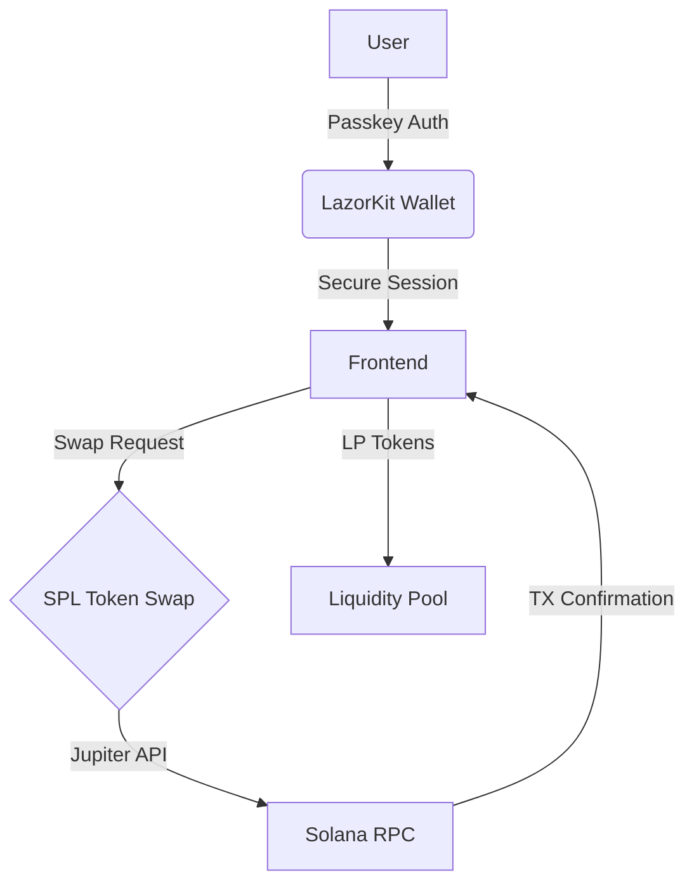

<h1 align="center">
  <br>
  <br>
  LazorSwap ⚡
  <br>
</h1>

<h4 align="center">Solana DEX with Passkey Authentication & Zero-Custody Swaps</h4>

<p align="center">
  
  
  
  
</p>

<p align="center">
  <a href="#-features">Features</a> •
  <a href="#-how-it-works">How It Works</a> •
  <a href="#-architecture">Architecture</a> •
  <a href="#-getting-started">Getting Started</a> •
  <a href="#-security">Security</a> •
  <a href="#-tech-stack">Tech Stack</a> •
  <a href="#-contributing">Contributing</a>
</p>


---

## ✨ Features

| Feature                | Description                                                                 | Tech Stack                  |
|------------------------|-----------------------------------------------------------------------------|-----------------------------|
| 🔐 **Passkey Auth**     | Biometric/FIDO2 login with device security                                 | LazorKit, WebAuthn          |
| ⚡ **Instant Swaps**    | SOL ↔ Lazy-Token swaps in <1s                                               | SPL Token Swap              |
| 💧 **Liquidity Pools** | Earn 0.3% fees on trades                                                    | Constant Product AMM        |
| 📊 **Portfolio Tracking** | Real-time balance updates                                                 | Solana Web3.js              |
| 🔒 **Non-Custodial**    | Users control assets end-to-end                                            | secp256r1 Signatures        |

---

## 🧠 How It Works

### 🔐 Authentication via LazorKit
- Login using device biometrics like Face ID or fingerprint.
- No wallet extensions, no private key management.

### 🔁 Token Swap
- Users swap between **Lazy-Token** and **SOL** (wSOL under the hood).
- Powered by Solana’s [SPL Token Swap](https://github.com/solana-labs/solana-program-library/tree/master/token-swap/program).

### 💧 Liquidity Provision
- Users deposit **Lazy-Token + wSOL** to the pool.
- In return, receive **Lazor-Tokens (LP tokens)**.
- These LP tokens can later be used to withdraw liquidity.

### 🧾 Transaction Signing
- All swaps, deposits, and withdrawals are passkey-signed with secp256r1.
- No browser wallet or private key exposure — it's WebAuthn-native.

---

## 🏗 Architecture



---

## 🚀 Getting Started

### 1. Clone the Repo

```bash
git clone https://github.com/your-org/lazorswap.git
cd lazorswap
```

### 2. Install Dependencies

```bash
pnpm install
```

### 3. Start the DApp

```bash
pnpm dev
```

Make sure to connect to a Solana devnet wallet using LazorKit.

---

## 🔒 Security

- 🔐 No seed phrase is ever stored.
- 💾 No cookies or localStorage misuse.
- 🔏 All operations are cryptographically signed with passkeys using `secp256r1`.

---

## 🧰 Tech Stack

- `@solana/web3.js` — Solana blockchain SDK
- `@solana/spl-token` — SPL token utilities
- `@solana/spl-token-swap` — Core swap logic
- `lazorkit` — WebAuthn wallet integration
- `Vite + React` — Frontend tooling
- `Tailwind CSS` — UI styling

---

## 🤝 Contributing

1. Fork the repo 🍴  
2. Create your feature branch `git checkout -b feat/amazing-feature`  
3. Commit your changes ✅  
4. Push to the branch `git push origin feat/amazing-feature`  
5. Open a Pull Request! 🚀

---

## 📄 License

MIT © 2025 — Built with ⚡ by Ajey

---
